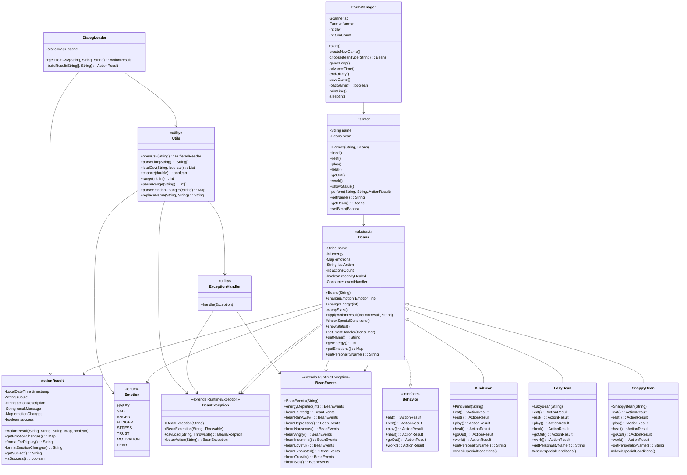

# GrowBean 프로젝트 구조 및 설계 요약

## 0. 프로젝트 설계 의도

이 프로젝트는 **객체 지향 프로그래밍(OOP)의 핵심 개념인 다형성과 캡슐화**를 실제로 구현해보기 위해 설계되었다.  
다마고치(Tamagotchi) 형태의 콘솔 게임을 기반으로, **콩(Bean)** 이라는 캐릭터가 각기 다른 성격을 가지고 행동에 따라 다른 반응을 보이는 구조를 목표로 하였다.  

특히 다음과 같은 의도를 가지고 설계되었다.

1. **성격별 대화 및 반응 차이 구현**  
   - 동일한 행동(`eat`, `rest`, `play` 등)에 대해 캐릭터의 성격에 따라 서로 다른 대사와 결과를 출력하도록 설계하였다.  
   - 이를 통해 사용자에게 보다 생동감 있고 개성 있는 상호작용을 제공하고자 하였다.

2. **다형성 학습 및 실습**  
   - 추상 클래스(`Beans`)와 인터페이스(`Behavior`)를 기반으로, 다양한 하위 클래스(`KindBean`, `LazyBean`, `SnappyBean`)가 고유의 행동을 구현하도록 하였다.  
   - 동일한 메서드 호출이 실제 객체의 타입에 따라 다른 결과를 출력하도록 하여 **런타임 다형성(polymorphism)** 을 명확히 체험할 수 있도록 구성하였다.

3. **객체 간 역할 분리 및 책임 분담**  
   - `Farmer`는 행동 명령을 전달하는 컨트롤러로, `Beans`는 상태와 로직을 담당하는 모델로 구분하였다.  
   - `FarmManager`는 전체 게임의 흐름을 관리하는 엔트리 포인트 역할을 수행한다.  
   - 이러한 구조를 통해 객체 간 결합도를 낮추고, 각 클래스의 책임을 명확히 구분하였다.

---

### 1. 클래스 다이어그램



- FarmManager는 게임의 전체 흐름을 제어하는 클래스이다.
- Farmer는 Bean 객체를 포함하며, 행동 명령을 중계한다.
- Beans는 추상 클래스이며, 성격별 Bean은 이를 상속받아 행동을 구체화한다.
- Behavior 인터페이스는 Bean의 행동 규약을 정의한다.

## 2. 플레이 화면

### 캐릭터 생성

### 성격 고르기

### 게임 플레이

### 특수 이벤트

### 상태 확인

### 저장, 불러오기


## 3. 문제 해결 

#### Index 6 out of bounds for length 6

#### 에너지 범위 초과 문제

#### stream classdesc serialVersionUID = xxxxx, local class serialVersion = ooooo

#### 이벤트 상태 체크

## 4. 사용된 기술 요약

### a. 캡슐화 (Encapsulation)
- Beans 클래스의 필드를 private 혹은 protected로 제한하였다.
- 외부에서는 getter, setter 또는 내부 메서드를 통해서만 접근이 가능하다.

```
protected int energy;
public int getEnergy() { return energy; }
public void changeEnergy(int delta) { ... }
```

내부 상태를 직접 수정하지 못하게 하여 데이터 무결성을 유지하였다.

### b. 다형성 (Polymorphism)
- Behavior 인터페이스를 통해 모든 Bean이 동일한 행동 메서드를 가진다.
- 실제 실행되는 결과는 Bean의 성격별 구현에 따라 달라진다.

```
@Override
public ActionResult play() {
    return DialogLoader.getFromCsv("lazy.csv", "play", getName());
}
```

동일한 메서드 호출(bean.play())이라도 클래스에 따라 다른 결과를 반환하도록 설계하였다.

### c. 예외 처리 (Exception Handling)
- BeanEvents(자연 이벤트)와 BeanException(오류)를 분리하였다.
- ExceptionHandler를 통해 예외 처리를 중앙 집중화하였다.

```
catch (BeanException e) {
    ExceptionHandler.handle(e);
}
```

- try-with-resources를 사용하여 파일 입출력 시 자원을 안전하게 닫도록 하였다.
- 게임 진행을 멈추지 않고 오류를 처리할 수 있도록 설계하였다.

---

## 5. 기술 선택의 근거

### Exception 클래스
- BeanEvents : 게임 내 자연 이벤트를 담당한다. (예: 콩이 화가 났습니다!)
- BeanException : 파일 로드 실패, CSV 구문 오류 등 실제 오류를 담당한다.
- ExceptionHandler : 예외 출력 및 색상 강조를 담당한다.

#### 분리 이유

| 구분 | 역할 |
|------|-----------------|
| BeanEvents | 게임 내에서 ‘자연스러운 상태 변화’를 알리는 이벤트. 오류가 아닌 상태 변화를 표현하므로, 게임 흐름을 멈추지 않기 위해 분리하였다. |
| BeanException | 시스템 또는 로직 오류를 나타내는 예외. 실제 오류 상황을 별도로 처리하기 위해 분리하였다. |
| ExceptionHandler | 콘솔 출력 및 예외 메시지 표준화. 예외 처리 코드를 중앙 집중화하여 유지보수성을 높이기 위해 사용하였다. |

#### 예시
```
catch (BeanException e) {
    ExceptionHandler.handle(e);
}
catch (Exception e) {
    ExceptionHandler.handle(BeanException.csvLoad(fileName, e));
}
```

게임 이벤트와 시스템 오류를 의미적으로 분리하여, 정상 흐름을 유지하면서도 예외를 명확하게 처리할 수 있도록 설계되었다.

---

### 상속과 인터페이스

- Behavior : 모든 콩이 수행해야 하는 행동 규약을 정의한 인터페이스이다.
- Beans : 콩의 공통 속성과 기본 로직을 정의한 추상 클래스이다.
- KindBean, LazyBean, SnappyBean : Beans를 상속받아 성격별 행동을 구현한 클래스이다.

#### 사용 이유

| 개념 | 사용 이유 |
|------|-----------|
| 인터페이스 (Behavior) | 모든 콩이 동일한 행동 메서드를 가지도록 강제하여 행동의 일관성을 확보하였다. |
| 추상 클래스 (Beans) | 이름, 에너지, 감정 등 공통 속성과 로직을 공유하고 일부만 하위 클래스가 직접 구현하도록 하였다. |
| 상속 클래스 | Beans의 공통 구조를 유지하면서, 성격에 따른 반응을 오버라이드하여 다형성을 구현하였다. |

#### 예시
```
Beans bean = new LazyBean("콩콩이");
ActionResult result = bean.play(); // LazyBean의 play()가 실행된다.
```

모든 콩이 동일한 행동을 하지만, 결과는 성격에 따라 다르게 표현되도록 다형성을 적용하였다.

---

### Map

감정 상태를 관리하기 위해 Map<Emotion, Integer>를 사용하였다.

#### 코드 예시
```
protected Map<Emotion, Integer> emotions;

public void changeEmotion(Emotion emotion, int delta) {
    int current = emotions.getOrDefault(emotion, 50);
    int next = Math.max(0, Math.min(100, current + delta));
    emotions.put(emotion, next);
}
```

#### 사용 이유
- 감정의 이름(종류)과 수치값을 동시에 관리해야 하므로 Key-Value 구조인 Map을 선택하였다.
- 특정 감정을 이름으로 빠르게 찾고 수정할 수 있다.
- 이 때, 감정은 변하지 않는 상수이므로 enum을 통해 정의하였다.

#### Map vs List vs Set 비교 요약표

| 자료구조 | 특징 | 적합 여부 | 설명 |
|-----------|-------|------------|------|
| Map | Key-Value 쌍 저장, 빠른 검색 (O(1)) | 적합 | 감정명(Key)과 감정 수치(Value)를 매핑하기에 이상적이다. |
| List | 순서 기반, 중복 허용 | 부적합 | 감정의 이름으로 접근하기 어렵다. |
| Set | 중복 불가, 값만 저장 | 부적합 | 감정의 수치값을 저장할 수 없다. |

요약하자면, 감정 상태를 관리하기 위해 감정명(Key)과 감정 수치(Value)를 한 쌍으로 다루는 Map이 가장 적절하였다.

---

## 6. 프로젝트의 강점 요약

| 항목 | 내용 |
|------|------|
| 구조적 완성도 | 추상 클래스와 인터페이스를 조합하여 Beans 계층 구조를 체계적으로 구성하였다. |
| 유연한 확장성 | 새로운 성격의 Bean을 추가할 때, CSV 파일과 Bean 클래스만 추가하면 된다. |
| 예외 안정성 | BeanEvents와 BeanException을 분리하여 오류와 이벤트를 명확히 구분하였다. |
| 데이터 주도 설계 | 행동 결과를 CSV로 외부화하여 밸런스 조정이 용이하다. |
| 캡슐화와 은닉성 | Bean의 내부 상태를 메서드를 통해서만 변경할 수 있다. |
| 다형성 구현 | Bean의 행동은 동일하지만, 결과는 성격에 따라 다르게 동작한다. |
| 유지보수성 | 패키지 구조 분리로 인하여 코드 확장 및 테스트가 용이하다. |
